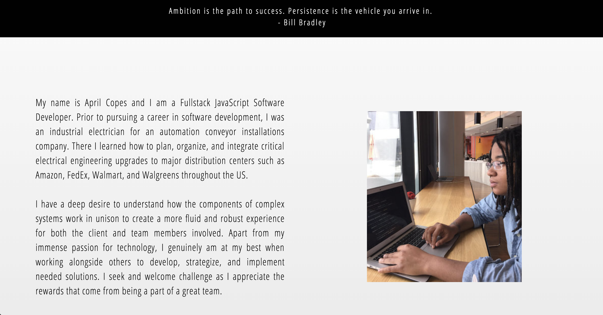
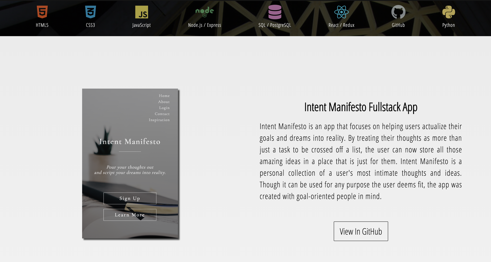
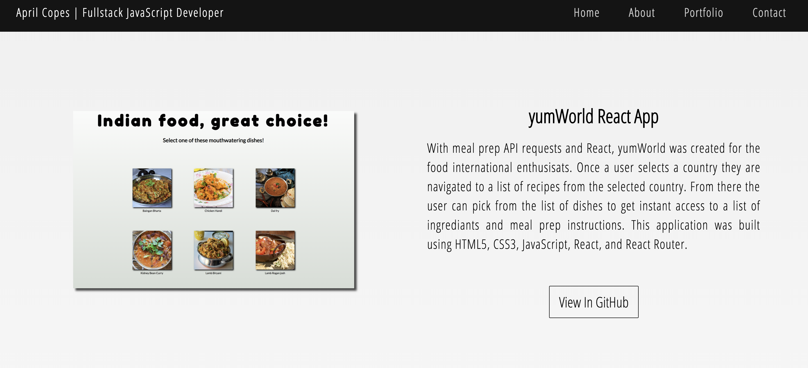
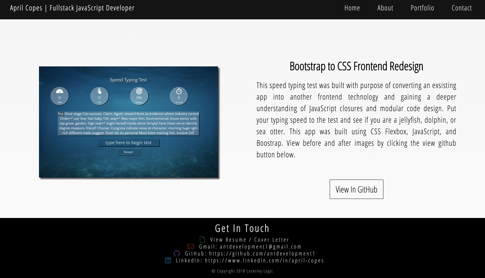

# April Copes | Portfolio Website
## [Live Website](http://aprilcopes.com)
---

## What Is This Project About
This website portfolio displays several projects I have built and contributed to most recently.

## Technologies used
* HTML
* CSS / Flexbox
* Vanilla JavaScript
* jQuery

## Site Walkthrough
<p>This is the landing page. In the background you will see am image of some of my favorites types of patterns called sacred geometry.</p>
<p align='center'>
    </img>
</p>
<p>This is the about section. Included is a short summary of my background.</p>
<p align='center'>
    </img>
</p>
<br>
<br>

### Here are some of the projects I have built and contributed to over the last few months.

<p>Intent Manifesto is a place for user to actualize their dreams into reality.</p>
<p align='center'>
    </img>
</p>
<p>yumWorld is a React food applications for international enthusiasts looking to mix up their normal food choices by cooking food recipes from around the world.</p>
<p align='center'>
    </img>
</p>
<p>Speed TypeWriter Test App is a front end redesign of an online course. This project was converted from bootstrap to CSS Flexbox.</p>
<p align='center'>
    </img>
</p>
<p>For more information, I've included is a list of my current contact infornmation. Feel free to reach out with any questions and suggestions.</p>
<p align='center'>
    </img>
</p>


## Code Walkthrough / Featues

### Landing Page Features
<p>The landing page header and hero section fades in using css animations. Each link on the navbar has a transition on hover with opacity of the text becoming slightly dimmer. Upon clicking each link the page takes the user to the corresponding section. The background images stays fixed to create a scroll effect.</p>

<p>CDN used for css animations</p>

```
<head>
    <meta charset="UTF-8">
    <meta name="viewport" content="width=device-width, initial-scale=1.0">
    <meta http-equiv="X-UA-Compatible" content="ie=edge">
    <link rel="stylesheet" href="https://use.fontawesome.com/releases/v5.5.0/css/all.css" integrity="sha384-B4dIYHKNBt8Bc12p+WXckhzcICo0wtJAoU8YZTY5qE0Id1GSseTk6S+L3BlXeVIU" crossorigin="anonymous">
    <link rel="stylesheet" href="https://cdnjs.cloudflare.com/ajax/libs/animate.css/3.7.0/animate.min.css">
    <link rel="stylesheet" href="./styles/styles.css">
    <title>Portfolio</title>
</head>
```

<p>CSS transitions for nav elements on hover</p>

```
.nav-container .nav li {
    /* outline: 1px solid blue; */
    /* display: flex; */
    padding: 13px 30px;
    letter-spacing: 1.5px;
    font-size: 25px;
}

.nav-container .nav li a {
    /* outline: 1px solid blue; */
    padding-bottom: 5px;
    transition: border-bottom .3s ease-out .2s, opacity .3s ease-in-out .3s;
    opacity: .8;
}

.nav-container .nav li a:hover,
.sitcky .nav li a:hover {
    border-bottom: 1px solid white;
    opacity: .6;
}
```

<p>Fixed background for background image in landing page</p>

```
.hero-section {
    display: flex;
    flex-direction: column;
    background-image: linear-gradient(rgba(0,0,0, .2), rgba(0,0,0,.9)), url(./../images/sacredg.jpg);
    background-position: center;
    background-attachment: fixed;
    background-size: cover;
    height: 100%;
    /* min-height: 100%; */
    justify-content: center;
    /* outline: 2px solid blue; */
}
```

### About Section Features
<p>The about section features a simple layout using CSS Flexbox to display the image and text in a row. The button in the container will take you to view my resume in a new tab. The button featues a simple color transition on hover.</p>

<p>Simple flex direction display on default to row</p>

```
.about-content {
    display: flex;
    /* outline: 1px solid blue; */
    margin: 50px auto 10px auto;
    padding: 80px 50px;
    width: 100%;
    align-content: center;
    align-items: center;
}
```

<p>Button transition on hover</p>

```
.resume-button {
 /* outline: 1px solid blue; */
    width: 50%;
    height: 75px;
    margin: 5px auto 80px auto;
    padding: 15px;
    text-align: center;
}

.resume-button a{
    /* outline: 1px solid purple; */
    font-size: 30px;
    width: 100%;
    padding: 12px 20px 12px 20px;
    color: black;
    border: 1px solid black;
    border-radius: 2px;
    transition: background-color .2s ease-in-out .1s, color .2s ease-in-out .1s;
}
```

<p>Open resume in a new tab</p>

```
<div class="resume-button">
    <a href="images/FinalResume.pdf" target="_blank">View Resume</a>
</div>
```

### About Section Features
<p>The portfolio section features an technology bar with various technologies I have gained experience using and working with. The icons have a simple scale and color transition. The background also featues the same fixed image from the hero section. The projects images have a box shadow on the images to add depth, a small description of the project, and a button with a color transition that takes you directly to the github repo for that project. Each image uses CSS animations to fade or slide in while the jQuery controls the timing of when the effect occurs based on pixel offsets.</p>

<p>Technology bar with fixed background image, scale, and transition on hover as well as image captions.</p>

```
.icon-bar {
    display: flex;
    align-items: center;
    justify-content: space-evenly;
    width: 100%;
    height: 130px;
    background-image: linear-gradient(rgba(0,0,0, .8), rgba(0,0,0,.8)), url(./../images/sacredg.jpg);
    background-position: center;
    background-attachment: fixed;
    background-size: cover;
    /* outline: 1px solid red; */
}


figure {
    display: flex;
    flex-direction: column;
    justify-content: center;
    /* width: 100%; */
}

figcaption {
    color: rgba(255, 255, 255, .9);
    font-size: 17px;
    letter-spacing: 1px;
    width: 100%;
    margin-top: 3px;
    padding: 5px;
    /* outline: 1px solid red; */
    text-align: center;
}

.icon-bar figure i {
    margin:auto 0;
    font-size: 50px;
    color: white;
    text-align: center;
    /* outline: 1px solid red; */
}

.icon-bar .fa-html5 {
    color: rgba(255,85,0, .7);
    transform: scale(1);
    transition: color .2s ease-in-out .1s, transform .2s ease-in-out .1s;
    /* outline: 1px solid green; */
}

.icon-bar .fa-html5:hover {
    color: rgba(255,85,0, 1);
    transform: scale(1.2);
}
```

<p>JavaScript waypoints animations class assingment</p>

```
    $('.js--wp-1').waypoint(function(direction) {
        $('.js--wp-1').addClass('animated fadeIn');
    },{
        offset:'50%'
    });
     $('.js--wp-2').waypoint(function(direction) {
        $('.js--wp-2').addClass('animated fadeIn');
    },{
        offset:'1%'
    });
     $('.js--wp-3').waypoint(function(direction) {
        $('.js--wp-3').addClass('animated slideInUp');
    },{
        offset:'50%'
    });
    $('.js--wp-4').waypoint(function(direction) {
        $('.js--wp-4').addClass('animated fadeInLeft');
    },{
        offset:'50%'
    });
```

### Contact Section Features


## Built By April Copes and Lauren Wilkerson
All design layouts are original layout ideas. No libraries or frameworks were used for layout design. Layouts were built in pure HTML and CSS.

