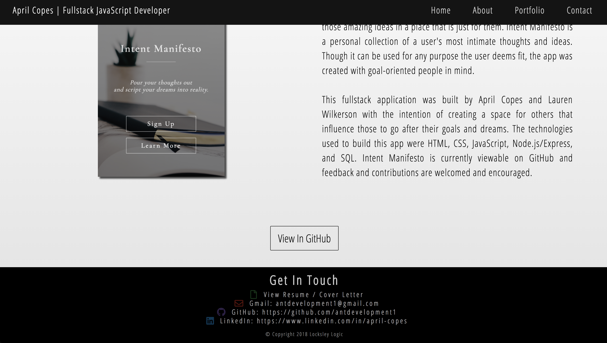

# April Copes Fullstack Software Developement Portfolio
## DESIGN BUILD IN PROGRESS - NOT YET RESPONSIVE

## Built By April Copes and Lauren Wilkerson
All design layouts are original layout ideas. No libraries or frameworks were used for layout design. Layouts were built in pure HTML and CSS.

## Teachnologies Used
- HTML5
- CSS3 / Flexbox
- Vanillia JavaScript
- jQuery

