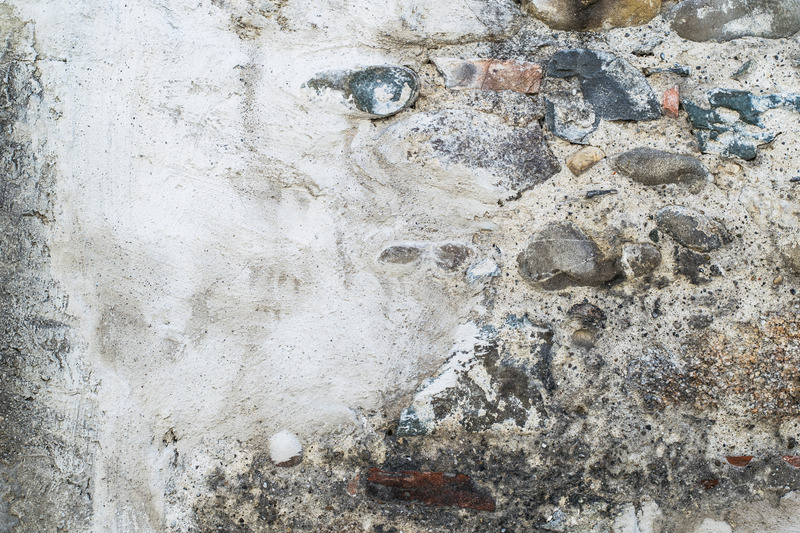

# April Copes | Portfolio Website
## [Live Website](http://aprilcopes.com)
---

## What Is This Project About
This website portfolio displays several projects I have built and contributed to most recently.

## Technologies used
* HTML
* CSS / Flexbox
* Vanilla JavaScript
* jQuery

## Site Walkthrough

This is the landing page

    </img>

## Code Walkthrough / Featues

## Built By April Copes and Lauren Wilkerson
All design layouts are original layout ideas. No libraries or frameworks were used for layout design. Layouts were built in pure HTML and CSS.

