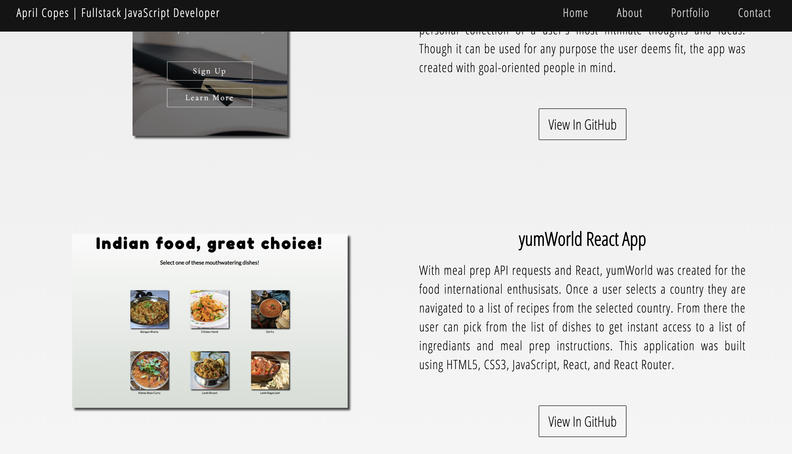

# April Copes | Portfolio Website
## [Live Website](http://aprilcopes.com)
---

## What Is This Project About
This website portfolio displays several projects I have built and contributed to most recently.

## Technologies used
* HTML
* CSS / Flexbox
* Vanilla JavaScript
* jQuery

## Site Walkthrough

This is the landing page. In the background you will see am image of some of my favorites types of patterns called sacred geometry.

    </img>

This is the about section. Included is a short summary of my background.

    </img>

Here are some of the projects I have built and contributed to over the last few months.

---

Intent Manifesto is a place for user to actualize their dreams into reality.

    </img>

yumWorld is a React food applications for international enthusiasts looking to mix up their normal food choices by cooking food recipes from around the world.

    </img>

Speed TypeWriter Test App is a front end redesign of an online course. This project was converted from bootstrap to CSS Flexbox.

    </img>

For more information, I've included is a list of my current contact infornmation. Feel free to reach out with any questions and suggestions.

    </img>

## Code Walkthrough / Featues

## Built By April Copes and Lauren Wilkerson
All design layouts are original layout ideas. No libraries or frameworks were used for layout design. Layouts were built in pure HTML and CSS.

